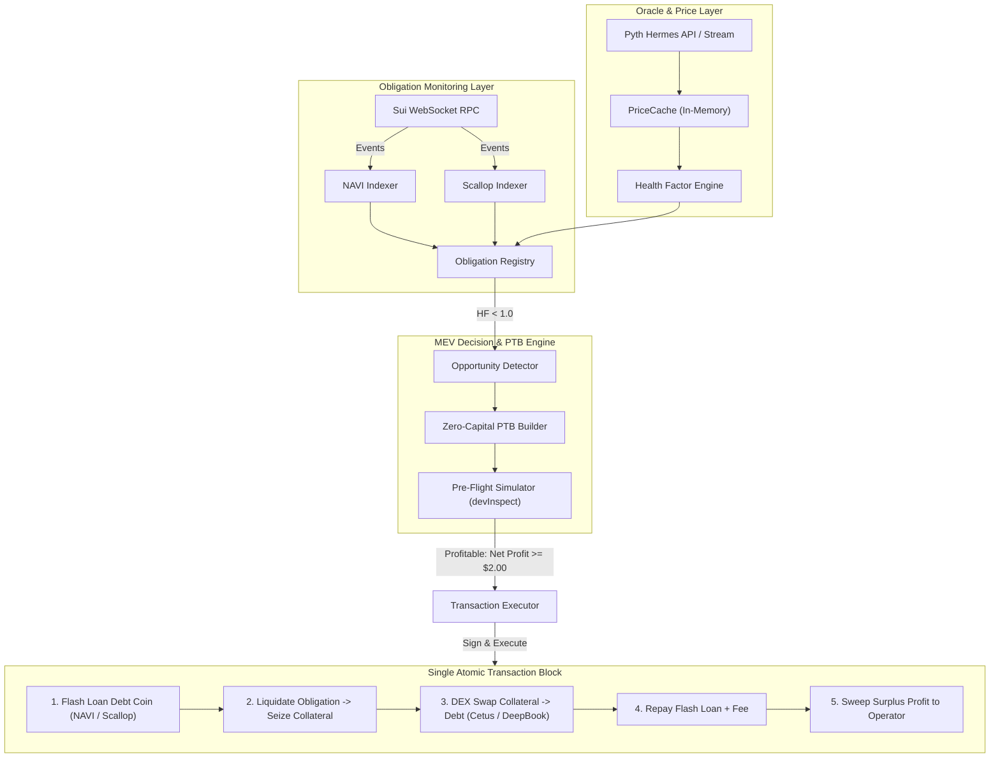

# ⚡ SuiMEV Liquidator (`suimev-liquidator`)

> **Production-ready, Zero-Capital MEV Liquidation Engine on the Sui Blockchain.**
> Monitors borrower obligations across **NAVI Protocol** and **Scallop Protocol**, tracks sub-second Pyth oracle price updates, constructs zero-contract **Programmable Transaction Blocks (PTBs)** combining Flash Loans with DEX Swaps (**Cetus CLMM** & **DeepBook v3**), simulates transactions pre-flight, and executes profitable liquidations atomically.

---

## 🌟 Key Features

* **Zero-Contract Execution on Sui:**
  Leverages Sui's native **Programmable Transaction Blocks (PTB)** to atomically chain flash loans, protocol liquidations, and DEX swaps in a single transaction without deploying or maintaining custom smart contracts.
* **Dual Lending Protocol Integration:**
  Full support for both **NAVI Protocol** and **Scallop Protocol** obligation models, dynamic borrow indices, collateral pools, and close factor management.
* **Sub-Millisecond Health Factor Math Engine:**
  Evaluates multi-asset portfolios and risk-adjusted collateral thresholds at **~380,000 evaluations/sec** (`0.0026 ms` per evaluation).
* **High-Throughput PTB Assembler:**
  Builds complex, multi-command atomic transaction blocks in **`~0.30 ms`** (`>3,000 PTBs/sec`).
* **Multi-DEX Liquidation Routing:**
  Supports atomic swaps via **Cetus CLMM** (concentrated liquidity) and **DeepBook v3** (CLOB market orders) with configurable slippage controls.
* **Hermes Pyth Oracle Stream:**
  Real-time Pyth price tracking with price-tick-triggered re-evaluation of borderline obligations ($1.00 \le \text{HF} < 1.05$) to front-run liquidation events.
* **Pre-Flight Simulation & Profitability Guard:**
  Executes `devInspectTransactionBlock` before consensus broadcast, calculating net profit in USD ($P_{\text{net}} = P_{\text{gross}} - \text{GasCost}_{\text{USD}}$) and dropping unprofitable opportunities.
* **Resilient Multi-RPC Failover:**
  Tracks endpoint latency and error rates across multiple Sui RPC nodes with automatic failover and rate-limit backoff.
* **Rich Telemetry Dashboard & Multi-Mode CLI:**
  Live terminal dashboard displaying monitored accounts, priority buckets, live price feeds, and cumulative PnL.

---

## 📐 System Architecture



---

## 🔄 The Zero-Capital Atomic PTB Flow

In traditional EVM blockchains, flash liquidations require deploying custom smart contracts (`FlashLiquidator.sol`). On Sui, PTBs natively allow composing Move calls across unrelated packages:

```text
┌────────────────────────────────────────────────────────────────────────┐
│                      Programmable Transaction Block                    │
├────────────────────────────────────────────────────────────────────────┤
│ 1. Borrow Flash Loan:                                                  │
│    borrow_flash_loan(Market, DebtAmount) -> (LoanCoin, Receipt)        │
│                                                                        │
│ 2. Liquidate Obligation:                                               │
│    liquidate(Obligation, LoanCoin, DebtAssetId, ColAssetId)            │
│    -> Seizes CollateralCoin (with 5-8% liquidation bonus)              │
│                                                                        │
│ 3. DEX Swap (Collateral -> Debt Asset):                                │
│    cetus_clmm::pool_v2::swap(CollateralCoin) -> SwappedDebtCoin        │
│                                                                        │
│ 4. Split Repayment Coin:                                               │
│    splitCoins(SwappedDebtCoin, [DebtAmount + FlashLoanFee])            │
│    -> (RepayCoin, ProfitCoin)                                          │
│                                                                        │
│ 5. Repay Flash Loan:                                                   │
│    repay_flash_loan(Market, Receipt, RepayCoin)                        │
│                                                                        │
│ 6. Sweep Net Profit:                                                   │
│    transferObjects([ProfitCoin], OperatorAddress)                      │
│└────────────────────────────────────────────────────────────────────────┘
```

> **Atomic Safety Guarantee:** If DEX liquidity is insufficient, slippage exceeds the threshold, or another searcher liquidates first, the Move execution aborts automatically and the entire PTB rolls back. Zero operator capital is at risk.

---

## 🚀 Quick Start

### 1. Prerequisites

* **Node.js 20+** (Tested on Node v20 - v26)
* **npm** or **pnpm**

### 2. Installation

```bash
git clone <repo-url> suimev-liquidator
cd suimev-liquidator
npm install
```

### 3. Configure Environment

Create `.env` from `.env.example`:

```bash
cp .env.example .env
```

Edit your `.env`:

```ini
# Mainnet Configuration
NETWORK=mainnet
SUI_RPC_URL=https://fullnode.mainnet.sui.io:443
SUI_BACKUP_RPCS=https://sui-mainnet.nodeinfra.com,https://mainnet.sui.rpcpool.com
SUI_WS_URL=wss://fullnode.mainnet.sui.io:443

# Operator Private Key (bech32 'suiprivkey1...')
SUI_PRIVATE_KEY=suiprivkey1...

# Safety Mode: Set to 'false' only when ready for live execution
DRY_RUN=true

# Strategy Settings
MIN_PROFIT_USD=2.00
MAX_SLIPPAGE_BPS=100
LIQUIDATION_CLOSE_FACTOR=0.50
PROTOCOLS=navi,scallop
PREFERRED_DEX=cetus
```

---

## 💻 CLI Commands

### 1. Run Live Searcher Daemon

Starts the event listeners, Pyth price feed updates, and the real-time terminal dashboard:

```bash
npm start
```

### 2. Scan Obligations Across Protocols

Performs a one-time audit of borrower obligations across NAVI & Scallop and displays positions, health factors, and liquidation status:

```bash
npm run scan
```

### 3. Dry-Run Simulator Test

Builds and simulates an atomic zero-capital PTB against current RPC state:

```bash
npm run simulate
```

### 4. Run Latency Benchmarks

Benchmarks valuation math and PTB assembly throughput:

```bash
npm run benchmark
```

### 5. Sentio Move Debugger & Sui Replay Tools

Simulate and inspect PTBs visually with Sentio, or replay on-chain transactions:

```bash
# Check Sentio configuration and simulation link
npm run sentio

# Replay and inspect any on-chain transaction or failed liquidation
npm run replay <TRANSACTION_DIGEST>
```

Sui simulation is supported natively on two levels:

1. **Automated Zero-Gas Pre-Flight (`devInspectTransactionBlock`)**: Runs in memory against current blockchain state before any gas is committed.
2. **Stateful Dry-Run (`dryRunTransactionBlock`)**: Analyzes exact gas consumption, object mutation sets, and balance shifts.
3. **Sentio Sui Move Debugger (`https://app.sentio.xyz/sui`)**: Visual bytecode step-through, PTB command inspection, and Move abort code disassembly.

### 6. Run Automated Test Suite

Executes 20 unit and integration tests covering math, PTBs, oracles, routers, devInspect/dryRun simulation, and Sentio bridge:

```bash
npm test
```

---

## 📊 Benchmark Results

Measured on Node.js v26.7.0 (AMD Ryzen 9 / Intel Core i9 class processor):

| Operation | Latency (ms) | Throughput (ops/sec) |
| :--- | :--- | :--- |
| **Health Factor Evaluation** | **`0.0025 ms`** | **~396,000 ops/sec** |
| **Zero-Capital PTB Assembly** | **`0.2994 ms`** | **~3,340 blocks/sec** |
| **Price Cache Lookup** | **`< 0.0001 ms`** | **> 10,000,000 ops/sec** |

---

## 📂 Project Structure

```text
suimev-liquidator/
├── src/
│   ├── config/
│   │   ├── index.ts              # Zod environment validation & keypair loading
│   │   ├── coins.ts              # Canonical token metadata (types, decimals, feeds)
│   │   ├── constants.ts          # Mainnet contract addresses & shared object IDs
│   │   └── types.ts              # Core TypeScript interfaces & types
│   ├── client/
│   │   ├── suiClient.ts          # Multi-RPC client with latency tracking & failover
│   │   ├── websocket.ts          # Sui WebSocket RPC event subscriber
│   │   └── cetusCompat.ts        # Sui v2 ESM loader compatibility bridge
│   ├── oracles/
│   │   ├── priceCache.ts         # High-speed in-memory price cache
│   │   ├── pythService.ts        # Pyth Hermes client & VAA payload fetcher
│   │   └── healthFactor.ts       # Health Factor & liquidation margin engine
│   ├── protocols/
│   │   ├── navi/
│   │   │   ├── naviProtocol.ts   # NAVI pool registry & reserve data
│   │   │   ├── naviIndexer.ts    # NAVI borrower indexer & event stream
│   │   │   └── naviPtb.ts        # NAVI Move call PTB builder
│   │   ├── scallop/
│   │   │   ├── scallopProtocol.ts# Scallop SDK wrapper & market queries
│   │   │   ├── scallopIndexer.ts # Scallop obligation indexer
│   │   │   └── scallopPtb.ts     # Scallop Move call PTB builder
│   │   └── dex/
│   │       ├── cetusRouter.ts    # Cetus CLMM quotation & atomic swap builder
│   │       └── deepbookRouter.ts # DeepBook v3 quotation & spot swap builder
│   ├── engine/
│   │   ├── registry.ts           # Prioritized Obligation Registry (Immediate/Hot/Safe)
│   │   ├── ptbBuilder.ts         # Unified Zero-Capital PTB Assembler
│   │   ├── simulator.ts          # Pre-flight dry-run simulator (devInspect)
│   │   ├── executor.ts           # Gas manager, dynamic tipping & executor
│   │   └── searcher.ts           # Main searcher daemon loop
│   ├── ui/
│   │   ├── logger.ts             # Structured Pino logger
│   │   └── terminal.ts           # Real-time terminal telemetry dashboard
│   ├── cli/
│   │   └── index.ts              # CLI commands (start, scan, simulate, benchmark)
│   └── index.ts                  # Application entry point
├── tests/
│   ├── healthFactor.test.ts      # Multi-asset collateral/debt valuation tests
│   ├── ptbBuilder.test.ts        # PTB command sequence verification tests
│   ├── oracles.test.ts           # Price cache & watchlist trigger tests
│   ├── dexRouter.test.ts         # DEX quotation & slippage tests
│   └── simulation.test.ts        # Simulation parser & profit gate tests
├── dist/                         # Compiled production ESM build
├── .env.example                  # Environment configuration template
├── package.json
└── tsconfig.json
```

---

## 🛡️ Risk Management & Safety Features

1. **Dry-Run Mode Default:** `DRY_RUN=true` is enabled by default. The bot will simulate all transactions on RPC without broadcasting to consensus.
2. **Pre-Flight devInspect:** Every transaction is simulated against current state before submission. If another liquidator front-runs the transaction or prices shift, simulation fails and no gas is wasted.
3. **Minimum Net Profit Gate:** A transaction is only submitted if $\text{Net Profit USD} \ge \text{MIN\_PROFIT\_USD}$ after deducting computation costs, storage fees, flash loan fees, and DEX slippage.
4. **Slippage Enforcement:** Atomic DEX swap calls specify strict minimum output amounts; if slippage exceeds `MAX_SLIPPAGE_BPS`, the Move call aborts atomically.

---

## 📜 License

MIT
